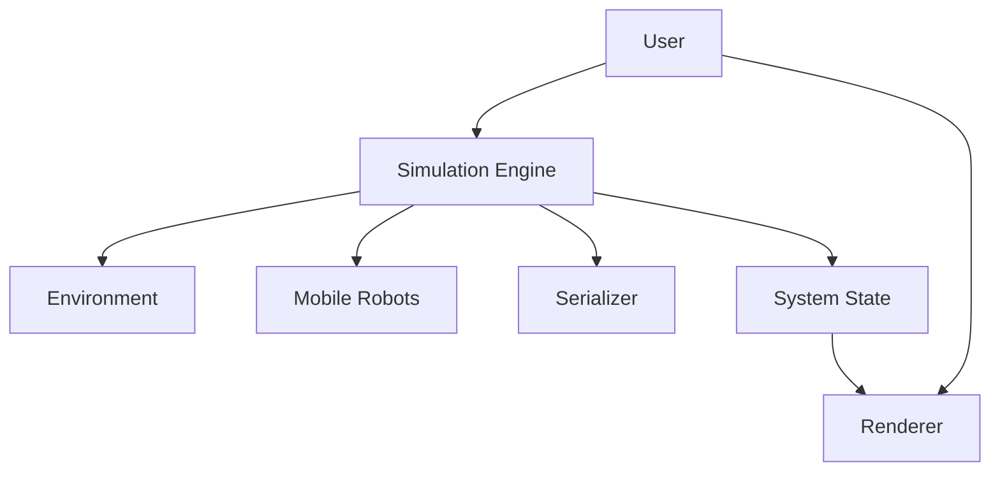
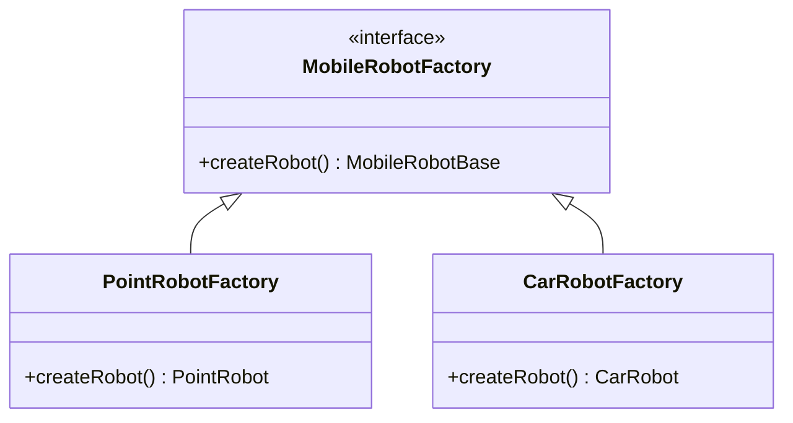
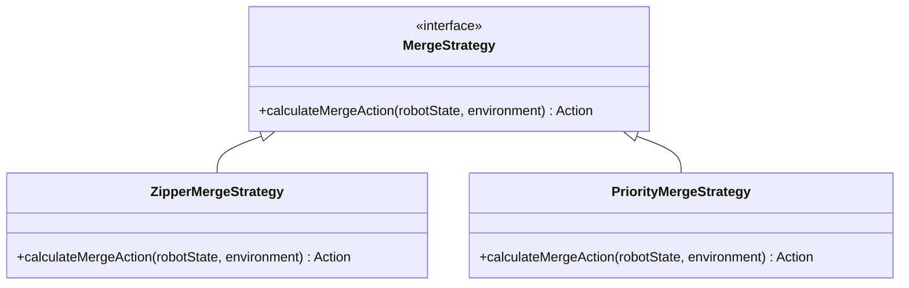
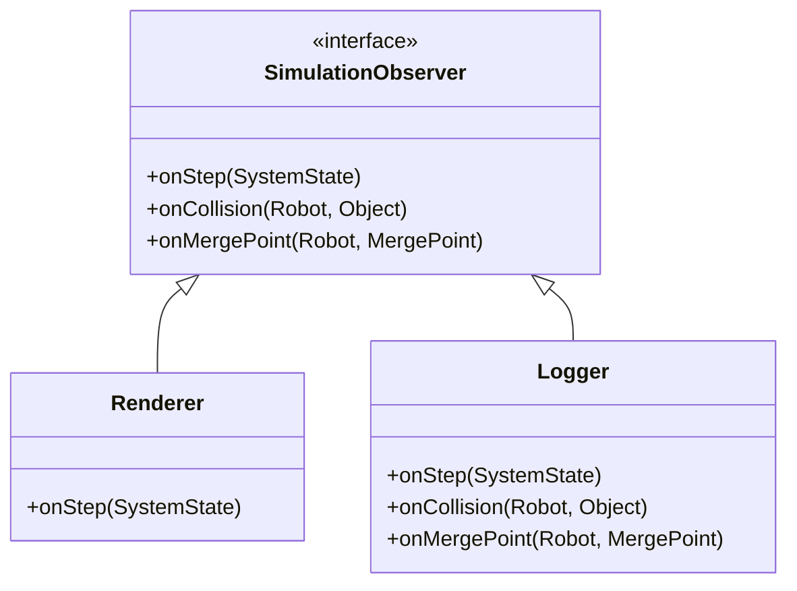
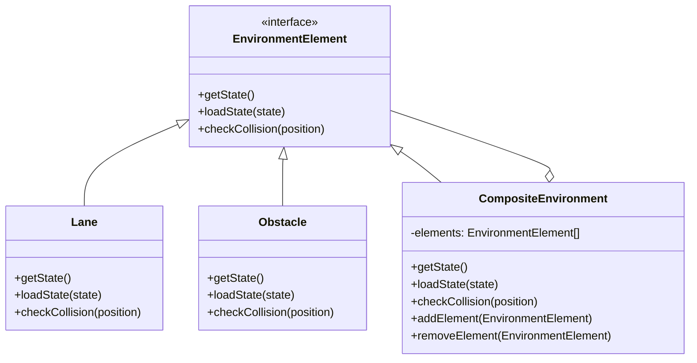
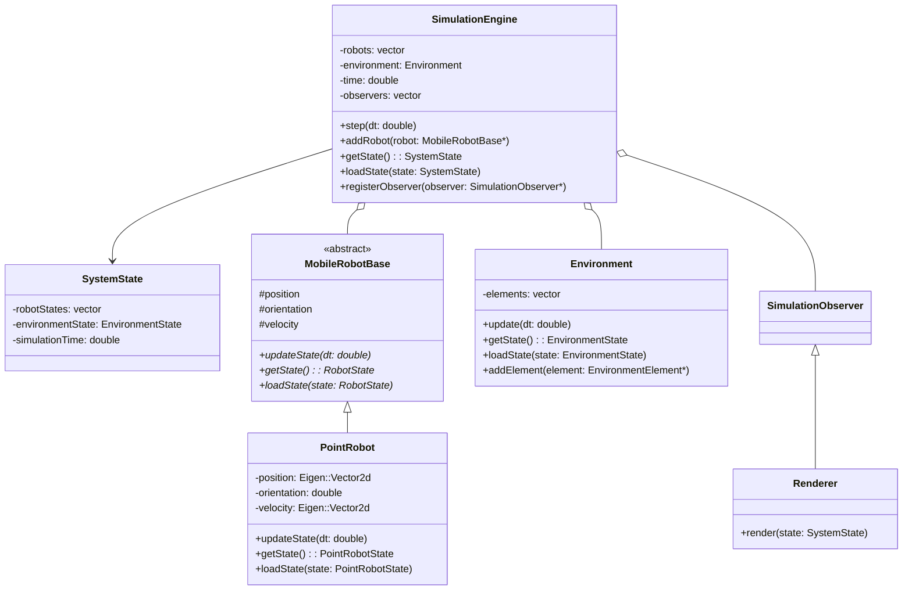
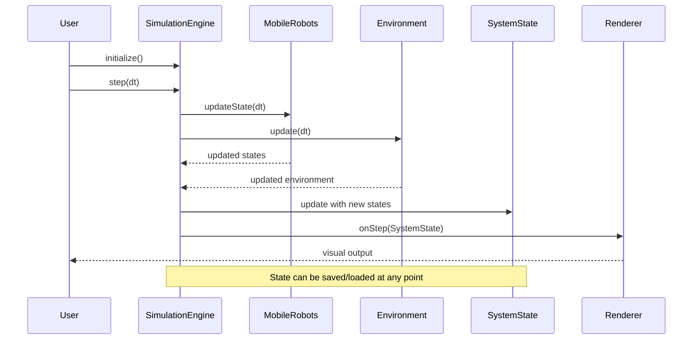

# MobileRobotSim System Patterns

## System Architecture

### High-Level Architecture

The MobileRobotSim architecture follows a clear separation of concerns with these primary components:

1. **Simulation Engine**: Central coordinator that manages the simulation loop, time advancement, and orchestrates interactions between robots and the environment.

2. **Environment**: Represents the static world elements such as lanes, obstacles, and merge points.

3. **Mobile Robots**: Hierarchy of robot implementations that follow a common interface but can have different kinematics and behaviors.

4. **System State**: Data structure that captures the complete simulation state at a point in time.

5. **Renderer**: Decoupled visualization component that consumes system state to produce visual output.

6. **Serializer**: Utility for converting system state to/from persistent storage formats.

## Key Design Patterns

### Abstract Factory
Used for creating different types of robots while maintaining a common interface:

### Strategy Pattern
Applied to robot behaviors, allowing different merging strategies to be swapped dynamically:

### Observer Pattern
Used for simulation events notification:

### Composite Pattern
Applied to environmental elements to create complex environments from simple components:

## Component Relationships

### Core Class Structure

## Data Flow

### Simulation Loop

## State Management

Every component in the system that maintains state implements:
1. `getState()` - Returns a serializable representation of its current state
2. `loadState(state)` - Reconstructs its state from a previously saved state

This consistent interface enables:
- Complete system snapshots
- Time travel debugging
- Scenario replays
- Crash analysis
- "What-if" experimentation

## Extension Points

The system is designed with several planned extension points:

1. **New Robot Types**: By implementing MobileRobotBase interface
2. **Alternative Environments**: Through the EnvironmentElement interface
3. **Different Rendering Options**: By implementing the SimulationObserver interface
4. **Custom Merge Behaviors**: Via the Strategy pattern for merge algorithms
5. **Spatial Optimization**: Future Quadtree implementation for efficient neighbor searching
