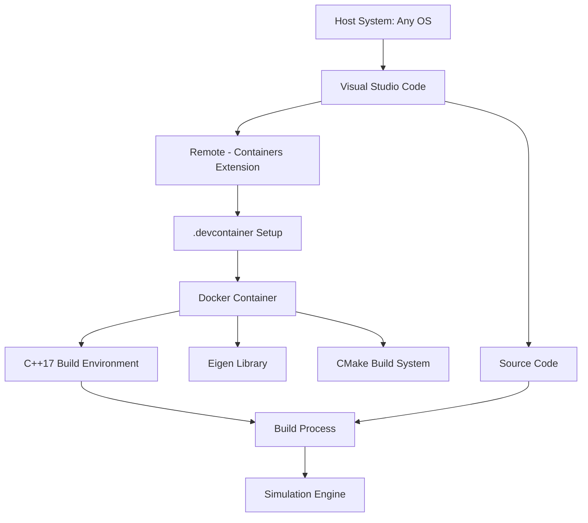

# MobileRobotSim Technical Context

## Technologies Used

### Core Development
- **Language**: C++17
  - Modern C++ features (auto, structured bindings, etc.)
  - Smart pointers for memory management
  - STL containers and algorithms
  - Lambda expressions

- **Linear Algebra**: Eigen 3.4+
  - Vector and matrix operations
  - Geometric transformations
  - Efficient numerical computations

- **Build System**: CMake 3.10+
  - Cross-platform build configuration
  - Dependency management
  - Test integration

### Development Environment
- **Containerization**: Docker
  - Reproducible development environment
  - Consistent build dependencies across platforms
  - CI/CD integration capability

- **IDE Integration**: VSCode with Remote Containers
  - Seamless container-based development
  - C++ development extensions
  - Debugging capabilities

### Testing
- **Unit Testing**: Catch2 or Google Test
  - Component-level validation
  - Test-driven development support

- **Simulation Validation**: Custom verification tools
  - Scenario-based testing
  - State verification

## Development Setup

### Container-Based Development


### Setup Process
1. Clone repository
2. Open in VSCode with Remote Containers extension
3. VSCode automatically builds and connects to development container
4. Build system configured through CMake
5. Development, testing, and debugging occur within container

## Technical Constraints

### Performance Considerations
- Real-time simulation capability for up to 100 robots
- Efficient state updates (target <1ms per robot per step)
- Minimize memory allocations during simulation loop
- Vectorized operations where possible using Eigen

### Memory Management
- Smart pointers preferred over raw pointers
- Clear ownership semantics
- Exception safety
- No memory leaks, even in error conditions

### Portability
- Cross-platform compatibility (Linux, macOS, Windows)
- Containerized for environment consistency
- No platform-specific code
- Explicit handling of endianness for serialization

### Threading
- Initially single-threaded for simplicity
- Design to allow future multi-threading:
  - Thread-safe component interfaces
  - Clear data ownership
  - Minimal shared state

## Dependencies

### Required External Libraries
- **Eigen (3.4+)**
  - Header-only linear algebra library
  - Used for vector/matrix operations
  - No additional runtime dependencies

- **JSON for Modern C++ (nlohmann/json)**
  - JSON serialization/deserialization
  - Used for state saving/loading
  - Header-only library

### Optional Dependencies
- **OpenGL + GLFW/SDL** (for visualization, if not headless)
  - Rendering infrastructure
  - Window management
  - User input processing

- **ImGui** (for debug interface)
  - Immediate-mode GUI
  - Visualization control
  - Parameter adjustment

### Development Dependencies
- **CMake (3.10+)**
- **C++17 Compiler**
  - GCC 8+ / Clang 6+ / MSVC 19.14+
- **Git**
- **Docker**
- **VSCode + Extensions**:
  - C/C++ Extension
  - CMake Tools
  - Remote - Containers
  - clangd extension for improved code intelligence
  - LLDB extension for advanced debugging

### Code Intelligence
- **clangd**
  - Language server for C++ code intelligence
  - Better code completion and navigation
  - Real-time error detection
  - Integration with clang-tidy for code quality analysis
  - Configuration via .clangd file

- **Formatting and Style**
  - clang-format for consistent code style
  - Automatic formatting on save
  - Style defined in .clang-format file

## Build Configuration

### CMake Structure
```
CMakeLists.txt                 # Root CMake configuration
├── cmake/                     # CMake modules
│   ├── FindEigen3.cmake       # Eigen3 finder
│   └── ...
├── src/                       # Source directory
│   ├── CMakeLists.txt         # Source build configuration
│   └── ...
├── include/                   # Header directory
│   ├── CMakeLists.txt         # Header installation
│   └── ...
└── test/                      # Test directory
    ├── CMakeLists.txt         # Test configuration
    └── ...
```

### Build Options
- `BUILD_TESTING`: Enable/disable test building
- `BUILD_RENDERER`: Enable/disable visualization component
- `USE_SYSTEM_EIGEN`: Use system Eigen or fetch from source
- `ENABLE_SANITIZERS`: Enable address/thread sanitizers (debug)

## Version Control

- **Git**: Primary version control system
- **GitHub Flow**: Feature branch workflow
  - `main` branch is always deployable
  - Feature branches for development
  - Pull requests for code review and merging
  - Protected main branch

## Future Technical Considerations

- **Quadtree Integration**: Spatial partitioning for efficient proximity queries
- **Multi-threading**: Parallel robot updates for improved performance
- **GPU Acceleration**: Potential CUDA integration for large-scale simulations
- **Network Interface**: Remote visualization or control capability
- **Reinforcement Learning Integration**: Interface for AI/ML systems
